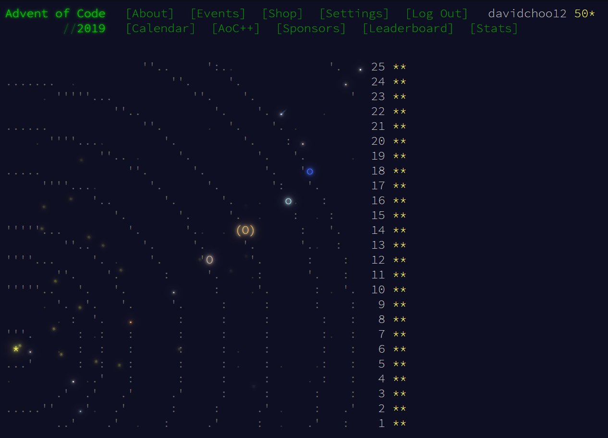

# Advent of Code 2019 solutions

I completed the Advent of Code 2019 challenge for the entire month of December, finishing it right on New Year's Eve. I took the chance to learn a new language like many others. I chose to solve these in python which is new to me. I just decided to document down my experience during the time of writing.

The following are some notable problems.

| Problem | Notes                                                                                                                                                                                                                |
| ------- | -------------------------------------------------------------------------------------------------------------------------------------------------------------------------------------------------------------------- |
| 4       | I solved this problem on my phone using [repl.it](https://repl.it/) while I was outside                                                                                                                              |
| 10a     | effectively a 2 liner solution, I'm proud of this haha                                                                                                                                                               |
| 13      | one of the coolest problem, automating a game of ball and brick                                                                                                                                                      |
| 15      | 2 steps to solve - automate map exploration (hugging right & left wall, I stopped when found destination and merged the 2 maps in 15a merge) and breadth first search                                                |
| 16b     | one of the harder problem, but I managed to solve it after getting some ideas from reddit                                                                                                                            |
| 17      | highlighting in vscode shows repeating occurrences, helps in figuring out the subpaths/functions                                                                                                                     |
| 18      | one of the more tedious questions, breadth first search with dynamic programming (first time I coded with dynamic programming). Trying to solve it without DP took forever in my laptop, but solves in 6 sec with DP |
| 19b     | tried out implementing some fancy search techniques - fibonacci search (initially intended to implement exponential search, but didn't get it working)                                                               |
| 20      | also one of the more tedious questions, mostly due to parsing of the map, but having solved problem 18 helps a lot                                                                                                   |
| 21      | fun boolean algebra exercise, probably the easiest one since the last 10+ problems                                                                                                                                   |
| 22b     | the hardest problem I find, involves modular arithmetic and geometric sum, I was stuck for a long time and had to read up on others' solutions                                                                       |
| 23      | multithreading and synchronization, good thing I took [CS2106](https://nusmods.com/modules/CS2106/introduction-to-operating-systems)                                                                                 |
| 24      | variant of [Conway's Game of Life](https://en.wikipedia.org/wiki/Conway%27s_Game_of_Life)                                                                                                                            |
| 25      | variant of [Hitchhiker's Guide to the Galaxy](https://www.bbc.co.uk/programmes/articles/1g84m0sXpnNCv84GpN2PLZG/the-game-30th-anniversary-edition)                                                                   |

`intcode.py` is the intcode "assembler" used by problems whose inputs are [intcode](https://adventofcode.com/2019/day/2). Problem 2 and all odd numbered problems except 1 and 3, use intcode. Intcode assembler is completed on problem 9, but `intcode.py` is created when working on problem 13, so it is duplicated only from problem 13 onwards.

Problem 15 onwards, I wrote down the answer to the each of the problems at the bottom of the file.
